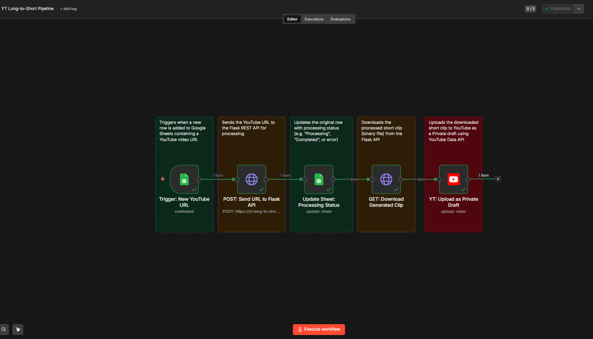
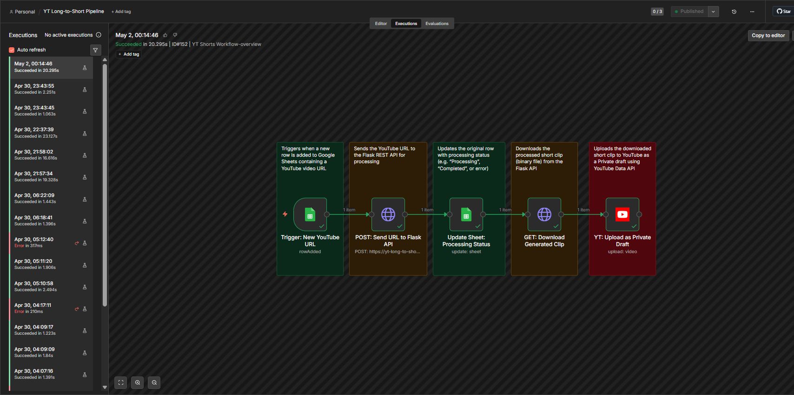
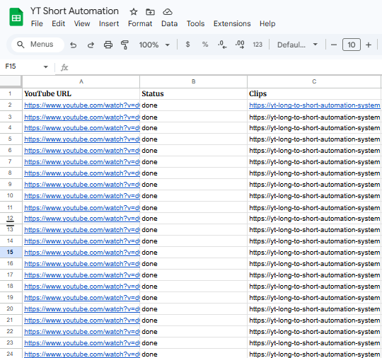
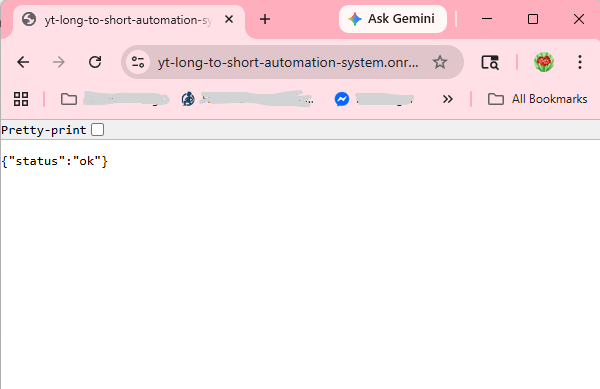
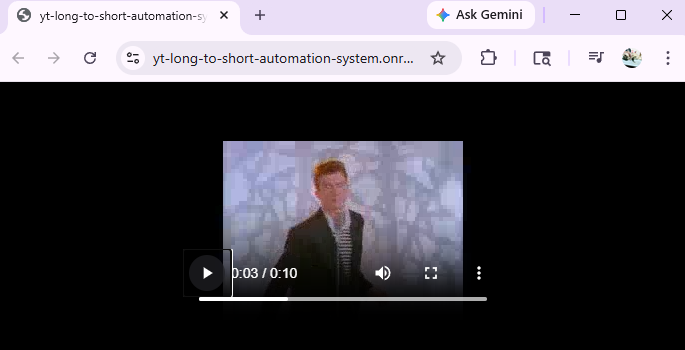
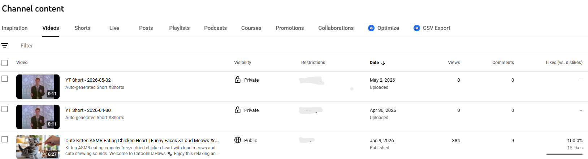

# 🎬 YT Long-to-Short Automation System

An end-to-end AI-powered automation system that converts long YouTube videos into short-form clips (YouTube Shorts / TikTok) with zero manual editing.

> Built as a portfolio project demonstrating AI integration, cloud deployment, and workflow automation.

---

## 🚀 Live Demo
- **API Health:** https://yt-long-to-short-automation-system.onrender.com/health
- **Trigger:** Drop a YouTube URL into Google Sheets → clip appears in YouTube drafts automatically

---

## 🏗️ Architecture

\`\`\`
Google Sheets (input: YouTube URL)
        ↓
n8n (workflow automation + scheduling)
        ↓
Flask REST API (Render cloud deployment)
        ↓
yt-dlp → download video
        ↓
AssemblyAI → AI transcription
        ↓
ffmpeg → slice into 20s clip
        ↓
YouTube Data API → upload as Private draft
        ↓
Google Sheets (updated with clip URL) ✅
\`\`\`

---

## 📸 Screenshots

### n8n Workflow Overview

### Workflow Execution (All nodes green ✅)

### Google Sheets Input & Output

### API Health Check

### Downloaded Clip

### YouTube Shorts Draft

---

## 🛠️ Tech Stack

| Layer | Technology |
|-------|------------|
| Language | Python 3.12 |
| API Framework | Flask + Gunicorn |
| Video Download | yt-dlp |
| AI Transcription | AssemblyAI |
| Video Processing | ffmpeg |
| Workflow Automation | n8n |
| Cloud Deployment | Render |
| Keep-Alive | cron-job.org |
| Storage Trigger | Google Sheets API |
| Output | YouTube Data API v3 |

---

## 📁 Project Structure

\`\`\`
yt-long-to-short-automation-system/
├── src/
│   ├── downloader/       # yt-dlp video download
│   ├── transcriber/      # AssemblyAI transcription
│   ├── clipper/          # clip detection + ffmpeg slicing
│   ├── captioner/        # caption burning (local only)
│   └── uploader/         # YouTube upload (via n8n)
├── screenshots/          # portfolio screenshots
├── output/               # generated clips (gitignored)
├── api.py                # Flask REST API
├── main.py               # local pipeline runner
├── Procfile              # Render deployment config
├── requirements.txt      # Python dependencies
└── .env                  # secrets (gitignored)
\`\`\`

---

## ⚙️ Local Setup

### Prerequisites
- Python 3.12+
- ffmpeg installed
- AssemblyAI API key
- Google Cloud project with YouTube Data API v3

### Installation
\`\`\`bash
git clone https://github.com/MDanieechi14/yt-long-to-short-automation-system
cd yt-long-to-short-automation-system
python -m venv venv
source venv/bin/activate
pip install -r requirements.txt
\`\`\`

### Environment Variables
Create a \`.env\` file:
\`\`\`
ASSEMBLYAI_API_KEY=your_key_here
\`\`\`

### Run locally
\`\`\`bash
python main.py
\`\`\`

### Run API locally
\`\`\`bash
python api.py
\`\`\`

---

## 🌐 Cloud Deployment (Render)

1. Push repo to GitHub
2. Connect to [Render](https://render.com)
3. Set build command: \`pip install -r requirements.txt\`
4. Set start command: \`gunicorn api:app --bind 0.0.0.0:$PORT --timeout 600\`
5. Add environment variable: \`ASSEMBLYAI_API_KEY\`
6. Set up [cron-job.org](https://cron-job.org) to ping \`/health\` every 5 minutes

---

## 🔄 n8n Workflow

| Node | Purpose |
|------|---------|
| Google Sheets Trigger | Detects new YouTube URL in sheet |
| HTTP Request (POST) | Sends URL to Flask API |
| HTTP Request (GET) | Downloads clip binary |
| Google Sheets Update | Writes clip URL + status |
| YouTube Upload | Uploads clip as Private draft |

---

## ⚠️ Known Limitations & Solutions

| Limitation | Cause | Solution |
|------------|-------|----------|
| Low resolution output (320p) | Render free tier 512MB RAM | Upgrade to Render $7/month (2GB RAM) |
| Single clip per video | Memory constraint | Multiple clips available on paid tier |
| No captions on cloud | Memory constraint | Full captions run locally via main.py |
| Cold start delay (~30s) | Render free tier sleep | cron-job.org keep-alive ping every 5min |
| No persistent storage | Render free tier ephemeral storage | Use Cloudinary or S3 for production |

---

## 🔮 Future Improvements

- [ ] Add caption burning on cloud (paid tier)
- [ ] Multiple clips per video
- [ ] Vertical crop for true Shorts format (9:16)
- [ ] Thumbnail generation
- [ ] TikTok upload integration
- [ ] Slack/email notification when clips are ready
- [ ] Web UI for non-technical users

---

## ⚠️ Security Notes
- All API keys stored in \`.env\` (gitignored)
- \`.env\` never committed to GitHub
- YouTube OAuth uses Google secure OAuth 2.0 flow

---

## 👤 Author
Built by [@MDanieechi14](https://github.com/MDanieechi14) as a portfolio project for AI automation / workflow engineering roles.
EOF
